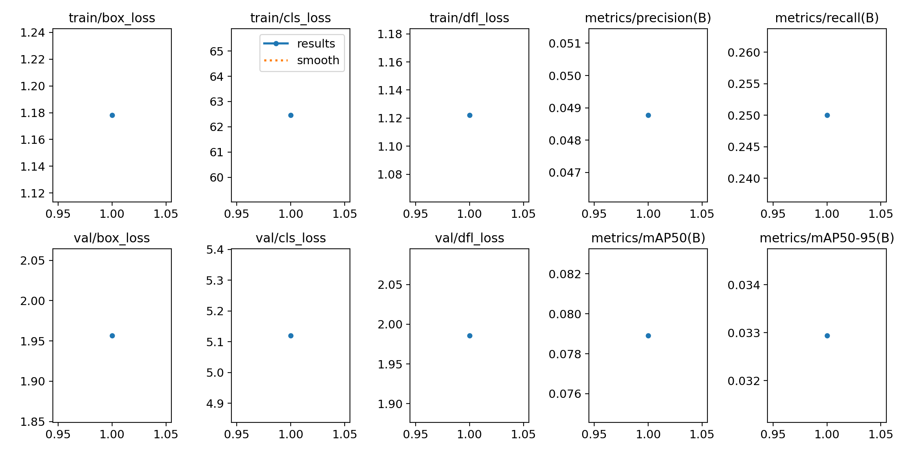
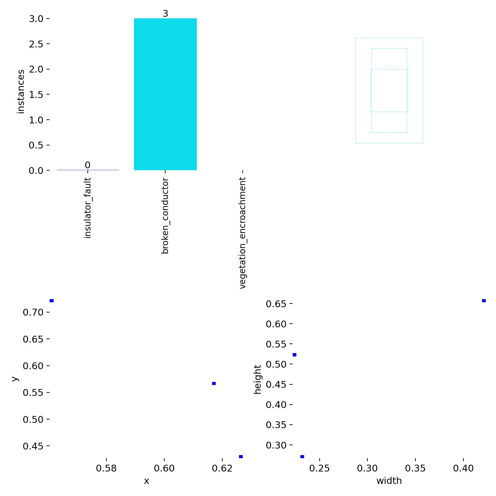

**Automated Power Infrastructure Fault Detection using YOLOv8
Overview**

Inspection of power transmission infrastructure is critical for maintaining a reliable electricity supply. Traditionally, this inspection is done manually or with helicopters, which is expensive, slow, and sometimes dangerous.

In this project, we will build an end-to-end computer vision system that automatically detects faults in power infrastructure from aerial (UAV) images using YOLOv8. It demonstrates object detection, dataset handling, training pipelines, and performance evaluation.

**Dataset**

A small sample from InsPLAD, a Power Line Asset Inspection Dataset and Benchmark containing 10,607 high-resolution Unmanned Aerial Vehicles color images. It is the first large real-world dataset and benchmark for power line asset inspection with multiple components and defects for various computer vision tasks (*André Luis et al, 2023*).

note: Only a small subset of the dataset is included in this repository for demonstration purposes.

The full dataset is publicly available at **https://github.com/andreluizbvs/InsPLAD/.**

**Dataset Structure**
The dataset is organized following YOLOv8 conventions:

│

├─ data/                   # Dataset folder

│   ├─ images/

│   │   ├─ train/

│   │   └─ val/

│   └─ labels/

│       ├─ train/

│       └─ val/

│   └─ data.yaml           # YOLO dataset config (data.yaml file defines train \& val paths and class names).

│

├─ models/                 # Trained weights will be saved here

├─ notebooks/              # notebooks for exploration

├─ src/                    # Training scripts

│   └─ train.py

├─ venv/                   # Virtual environment

├─ requirements.txt        # Python dependencies

└─ README.md

**Setup \& Installation**
**Clone the repository**
git clone https://github.com/Najwa1/Power-infrastructure-fault-detection-yolov8.git

cd Power-infrastructure-fault-detection-yolov8

**Create a virtual environment**
python -m venv venv

**Activate the virtual environment**

Windows (PowerShell):

venv\\Scripts\\Activate.ps1

\*\* If you get a security error, run:

Set-ExecutionPolicy -ExecutionPolicy RemoteSigned -Scope CurrentUser

macOS/Linux:
source venv/bin/activate

**Install dependencies**

pip install -r requirements.txt

**Run training**

python src/train.py
**Dataset Configuration**

data/data.yaml example:

train: data/images/train

val: data/images/val

nc: 3  # Number of classes

names: \["insulator\_fault", "vegetation\_encroachment", "other\_fault"]

**Performance Metrics**

## Model Performance

***\*\*Metrics generated using YOLOv8 evaluation after training for 1 epoch.***

| Metric        | Value |
|---------------|-------|
| Precision (P) | 0.049 |
| Recall (R)    | 0.25  |
| mAP@50        | 0.079 |
| mAP@50–95     | 0.033 |

## 📈 Training Metrics

### Precision, Recall & mAP Curves

### Dataset Label Distribution

